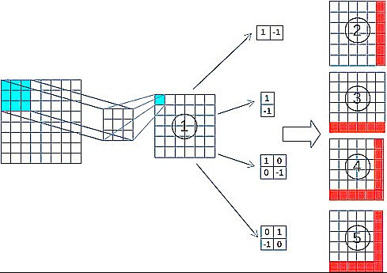

# Differential Convolution Modification

  

## 📊 Overview
This repository presents a modification of the [Differential Convolution]([Completed]_Differential_Convolution.ipynb) technique, reducing the feature maps from the original five to four. This modification aims to explore the effects of [feature map](Diffconv-4-5-6-Maps.ipynb) reduction on model performance and efficiency.

## 📈 [Performance Comparison](Testing-Diffconv-4-5-and-6-[COMPLETE].ipynb)
- **Without Modification**: 80.33%
- **With Modification (4 Feature Maps)**: 85.47%
- **Original (5 Feature Maps)**: 85.58%
- **Isselmou (6 Feature Maps)**: 85.62%

## 🔍 Results
The modified Differential Convolution, using 4 feature maps, demonstrates competitive performance with an accuracy of 85.47%, closely approaching that of the original and Isselmou's versions. This suggests that reducing feature maps can maintain high performance while potentially offering gains in efficiency.

## 💡 Key Insights
- The modification showcases the possibility of achieving competitive perfromance with less computational demands
- This approach's primary focus is efficiency.

## 📖 References
1) Sarıgül, M., B.M. Ozyildirim, and M. Avci. "Differential Convolutional Neural Network." Neural Networks 116, (2019): 279-287. Accessed February 4, 2024. https://doi.org/10.1016/j.neunet.2019.04.025.
2) Abd El Kader I, Xu G, Shuai Z, Saminu S, Javaid I, Salim Ahmad I. Differential Deep Convolutional Neural Network Model for Brain Tumor Classification. Brain Sci. 2021 Mar 10;11(3):352. doi: 10.3390/brainsci11030352. PMID: 33801994; PMCID: PMC8001442.

